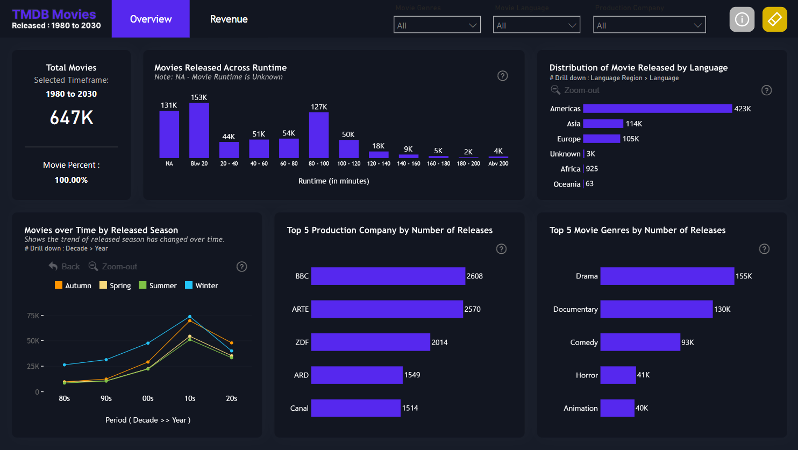
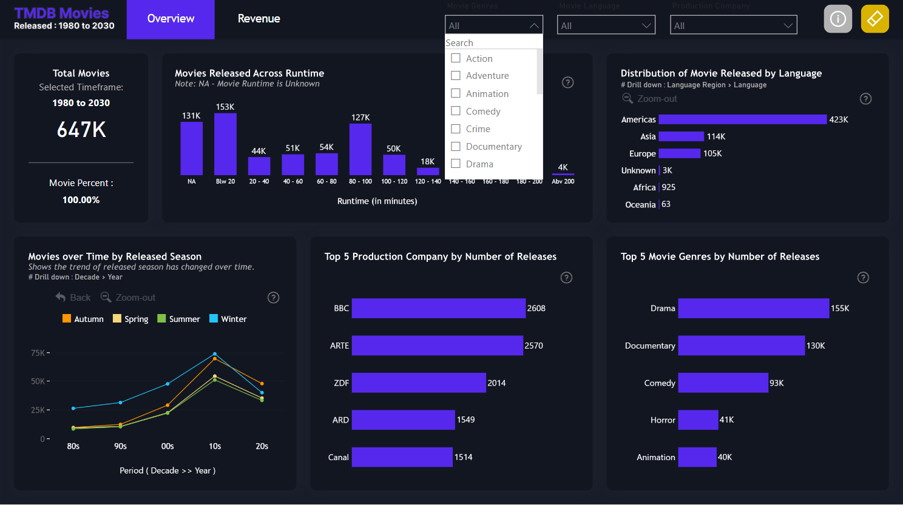
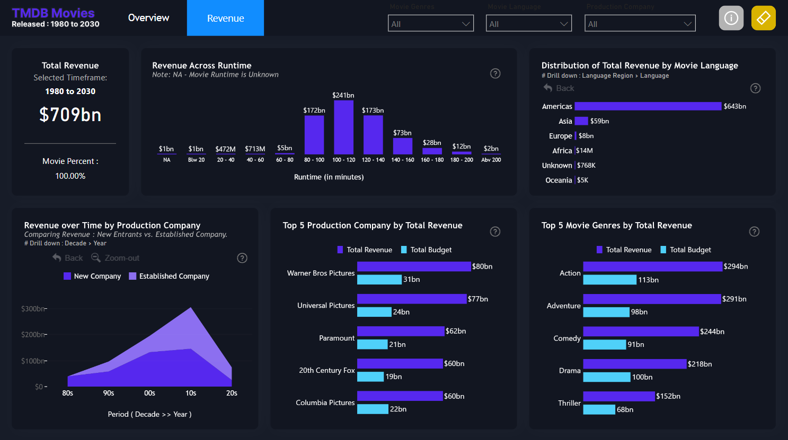
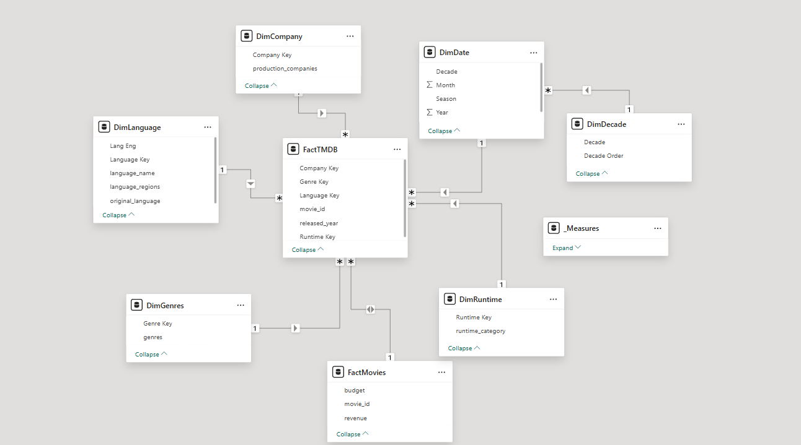

# Film-Verse 🎥

**A Movie Recommender System built with Streamlit, powered by TMDb API**

---

## Project Overview
**Film-Verse** is designed for movie enthusiasts seeking a tailored and effortless way to discover new films. Whether you’re a casual viewer or a devoted cinephile, this movie recommender app offers personalized recommendations, making it quick and enjoyable to find films that match your taste.


---

## Project Structure
**Streamlit Application**: A user-friendly application that provides movie recommendations based on content-based similarity.
**Jupyter Notebook**: Contains exploratory data analysis (EDA) and implementations of both collaborative and content-based filtering. This notebook demonstrates the approach taken to build and evaluate the different recommendation models.
**Models and Data**: Precomputed similarity matrices and movie metadata are stored as .pkl files for efficient loading.

---

## Features
- **Movie Selection**: Choose a movie from a comprehensive list to generate recommendations.
- **Customizable Recommendations**: Select the number of movie recommendations to display.
- **Rating Filter**: Filter movies based on a minimum rating threshold.
- **Movie Details**: View additional details like movie ratings and posters.
- **Interactive UI with Streamlit**: User-friendly and interactive UI for seamless navigation.
- **Content-Based Recommendation**: Uses cosine similarity to recommend movies similar to the selected title.
- **API Integration**: Integrates with The Movie Database (TMDb) API for real-time movie data.
- **Efficient Data Handling**: Uses pickle files for precomputed similarity data, improving response time.
- **Dynamic UI Elements**: Provides toggle options, filter choices, and custom recommendation numbers.
- **Error Handling**: Manages API request errors gracefully to ensure a smooth user experience.

---

## Installation
1. **Clone the repository**:
   ```bash
   git clone https://github.com/username/Film-Verse.git
   cd Film-Verse
   ```

2. **Install dependencies**:
   ```bash
   pip install -r requirements.txt
   ```

3. **Run the Streamlit app**:
   ```bash
   streamlit run app.py
   ```

---

## API Reference
**Fetch movie details from TMDb API**:

| Parameter | Type | Description |
| --------- | ---- | ----------- |
| `api_key` | `string` | **Required**. API key for authentication |
| `id`      | `string` | **Required**. Unique movie ID (e.g., `530` for *A Grand Day Out*) |

Replace the `api_key` value in your code with your TMDb API key.

---
## Dashboards 






---

## Acknowledgements
Special thanks to the tools and communities that made this project possible:
- **Streamlit**: For the user-friendly framework for building the app interface.
- **pandas**: For efficient data manipulation.
- **Power BI**: For exploratory data analysis and visualization.
- **scikit-learn**: For machine learning tools like `cosine_similarity` used in recommendations.
- **TMDb API**: For access to up-to-date movie information and posters.
- **Open-source Contributors**: For resources, tutorials, and ongoing support from the developer community.

---

## Usage
1. **Select a Movie**: Choose a movie from the dropdown to generate similar recommendations.
2. **Set Number of Recommendations**: Specify the number of movies to display.
3. **Apply Rating Filter**: Optionally filter recommendations to show movies above a certain rating threshold.
4. **View Recommendations**: Movie posters and ratings are displayed, with each recommendation linked to its details.
